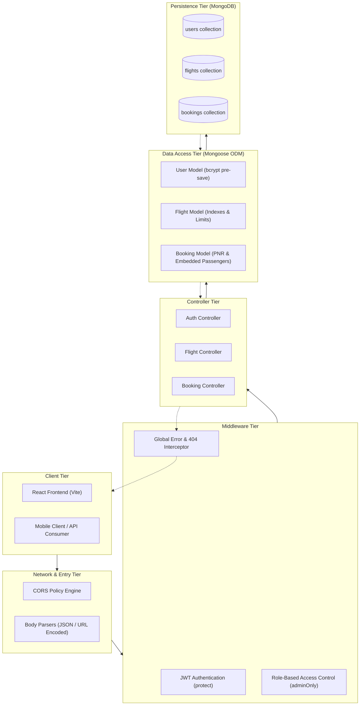
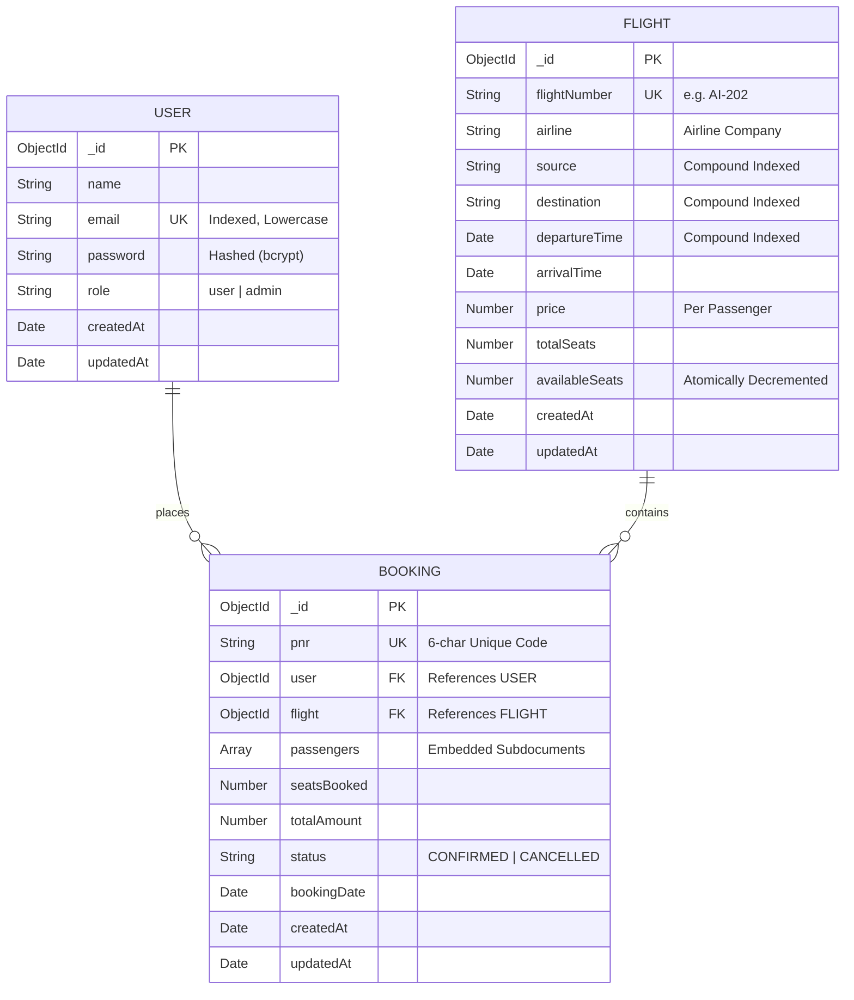
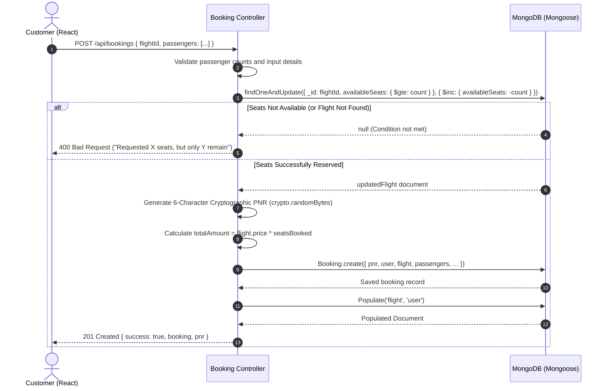
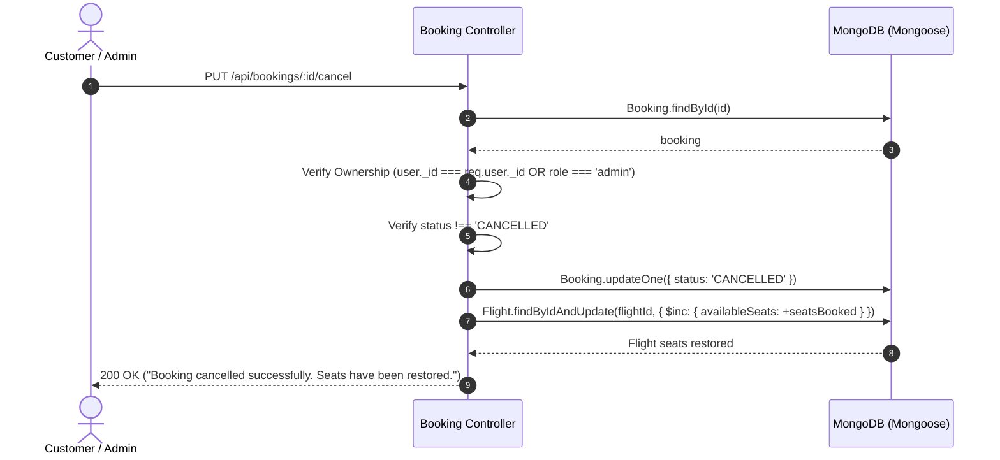

# Backend Architecture Blueprint - Flight Booking System

Comprehensive architectural blueprint, data models, workflows, API contracts, and security mechanisms of the Flight Booking System backend.

---

## 1. High-Level Architectural Flow

---

## 2. Database Entity-Relationship (ER) Blueprint

---

## 3. Core Operational Workflows

### 3.1. Atomic Flight Booking & Concurrency Protection

To prevent race conditions, double bookings, and seat over-allocation under concurrent traffic, the backend avoids reading and writing seats in two separate steps. Instead, it utilizes an atomic query condition:

---

### 3.2. Booking Cancellation & Seat Restoration

---

## 4. Complete API Contract & Routing Specifications

Base URL: `http://localhost:5000/api`

### 4.1 Authentication (`/api/auth`)

| Method | Endpoint | Access | Request Body | Success Response |
|---|---|---|---|---|
| `POST` | `/api/auth/register` | Public | `{ name, email, password }` | `201 Created` `{ success: true, token, user }` |
| `POST` | `/api/auth/login` | Public | `{ email, password }` | `200 OK` `{ success: true, token, user }` |
| `GET` | `/api/auth/profile` | Protected (User/Admin) | None (Bearer Token header) | `200 OK` `{ success: true, user }` |

### 4.2 Flight Management (`/api/flights`)

| Method | Endpoint | Access | Query / Request Body | Success Response |
|---|---|---|---|---|
| `GET` | `/api/flights` | Public | Query: `?source=DEL&destination=BOM&date=YYYY-MM-DD` | `200 OK` `{ success: true, count, flights: [...] }` |
| `GET` | `/api/flights/:id` | Public | None | `200 OK` `{ success: true, flight }` |
| `POST` | `/api/flights` | Admin Only | `{ flightNumber, airline, source, destination, departureTime, arrivalTime, price, totalSeats }` | `201 Created` `{ success: true, flight }` |
| `PUT` | `/api/flights/:id` | Admin Only | `{ price, totalSeats, departureTime, ... }` | `200 OK` `{ success: true, flight }` |
| `DELETE` | `/api/flights/:id` | Admin Only | None (Checks active bookings before delete) | `200 OK` `{ success: true, message }` |

### 4.3 Bookings Engine (`/api/bookings`)

| Method | Endpoint | Access | Request Body | Success Response |
|---|---|---|---|---|
| `POST` | `/api/bookings` | Protected (User) | `{ flightId, passengers: [{ name, age, gender, seatNumber }] }` | `201 Created` `{ success: true, booking }` |
| `GET` | `/api/bookings/my-bookings` | Protected (User) | None | `200 OK` `{ success: true, count, bookings: [...] }` |
| `GET` | `/api/bookings/pnr/:pnr` | Protected (User/Admin) | None (PNR in route parameter) | `200 OK` `{ success: true, booking }` |
| `PUT` | `/api/bookings/:id/cancel` | Protected (User/Admin) | None | `200 OK` `{ success: true, message, booking }` |
| `GET` | `/api/bookings/admin/all` | Admin Only | None | `200 OK` `{ success: true, count, bookings: [...] }` |

---

## 5. Security & Data Integrity Blueprint

1. **Authentication (JWT)**:
   - Secret signed using HMAC SHA-256 (`process.env.JWT_SECRET`).
   - Token payload: `{ id: user._id, role: user.role }`.
   - Lifespan: Default 30 days (`JWT_EXPIRES_IN=30d`).
2. **Password Security (bcryptjs)**:
   - Salts generated with 10 rounds before storing hash in MongoDB.
   - Plaintext passwords never stored or returned in serialized responses.
3. **Role-Based Access Control (RBAC)**:
   - Granular middleware `authorize('admin')` validates `req.user.role === 'admin'`.
   - Non-admin attempts return standard `403 Forbidden` JSON.
4. **Database Indexing**:
   - Compound index: `{ source: 1, destination: 1, departureTime: 1 }` on `Flight` collection for $O(\log N)$ route lookups.
   - Unique sparse index on `flightNumber` and `pnr`.
5. **Centralized Error Handling**:
   - Mongoose `CastError` translated to standard `404 Not Found`.
   - Duplicate key error (`code 11000`) translated to `400 Bad Request`.
   - Mongoose schema `ValidationError` mapped into clean human-readable validation messages.
